# Integre-Instana-con-una-aplicacion-de-microservicio-en-OpenShift-

https://developer.ibm.com/patterns/integrating-instana-with-microservice-app-on-openshift/

# Introducción
En este patrón de código, integraremos [Instana](https://www.instana.com/) con una aplicación de viajes de microservicio políglota en OpenShift. Instana es una solución de Observabilidad Empresarial totalmente automatizada, con supervisión de la infraestructura y Gestión del Rendimiento de las Aplicaciones (APM), diseñada específicamente para los desafíos de la gestión de aplicaciones nativas de la nube y de microservicios. Generaremos tráfico a la aplicación usando [Puppeteer](https://developers.google.com/web/tools/puppeteer/) ahí analizaremos el tráfico en el panel de Instana. La aplicación de viaje utilizada en este patrón de código es parte del proyecto [Bee Travels](https://bee-travels.github.io/) que se centra en algunos de los servicios de la primera versión de la aplicación. Los servicios incluidos en este Code Pattern  son:
* Destination v1 (Node.js)
* Car Rental v1 (Node.js)
* Hotel v1 (Python)
* Currency Exchange (Node.js)
* UI (Node.js/React)

## Requisitos previos

* [IBM Cloud account](https://cloud.ibm.com/registration)
* [OpenShift CLI (oc)](https://cloud.ibm.com/docs/openshift?topic=openshift-openshift-cli#cli_oc)
* [Docker](https://www.docker.com/products/docker-desktop)
* [NodeJS](https://nodejs.org/en/download/)
* [NPM](https://www.npmjs.com/get-npm)
* [Yarn](https://classic.yarnpkg.com/en/docs/install)
* [Pupeteer](https://developers.google.com/web/tools/puppeteer/get-started)
* [Acceso a Instana](https://www.instana.com/trial/)

# Flujo

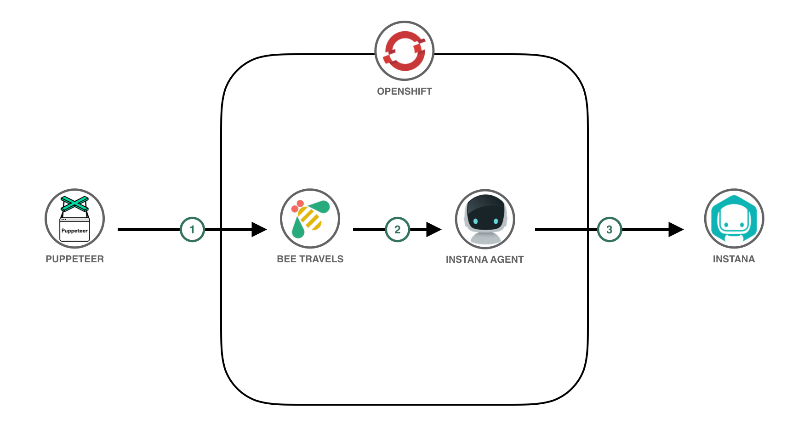

1. El script Puppeteer genera tráfico a la aplicación Bee Travels que se ejecuta en el clúster de OpenShift.
2. El código Instana en cada servicio de la aplicación Bee Travels envía datos sobre cada servicio respectivo al Agente Instana en el clúster de OpenShift (un Agente Instana por nodo del clúster).
3. El Agente Instana envía esos datos a su cuenta en Instana, donde puede analizar / monitorear los microservicios de Bee Travels a través del panel de Instana.

# Steps

1. [Requisitos previos](#requisitos-previos)
2. [Integrar Instana](#2-integrar-Instana)
3. [Deploy to OpenShift](#3-implementar-en-OpenShift)
4. [Generate Traffic and Analyze with Instana](#4-generate-traffic-and-analyze-with-instana)


## 2. Integrar Instana

Una vez que tenga acceso a Instana, abra el panel de Instana. Presione  `Add Website` e ingrese un nombre para su sitio web ej. `Bee Travels`

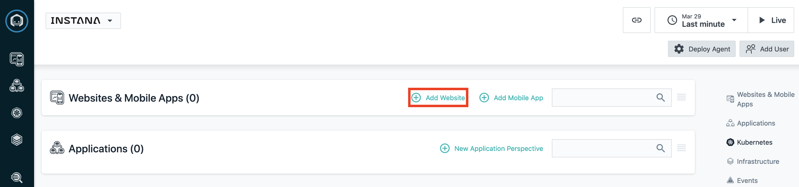

opie el script generado e insértelo en la`<head>` etiqueta de [/src/services/ui/frontend/public/index.html](src/services/ui/frontend/public/index.html). Esto integra Instana en la interfaz de usuario de la aplicación. Esto ahora le permitirá analizar las cargas de la página, el tráfico y más en la parte frontal de la aplicación.

Instana ya está integrado en los servicios. Para aprender a integrar Instana con sus propios servicios, se proporciona documentación para integrar Instana en aplicaciones [Node.js](https://www.instana.com/docs/ecosystem/node-js/configuration/) y [Python](https://www.instana.com/docs/ecosystem/python/configuration/), así como [muchas otras tecnologías](https://www.instana.com/docs/ecosystem/). Tener Instana en los servicios de backend permite que los rastreos distribuidos, la telemetría y otra información sobre las llamadas realizadas a un servicio se envíen a Instana. Además, puede analizar las llamadas de rastreo individuales para mostrar cómo se comunican sus servicios entre sí. Puede ver cómo se integra Instana en cada servicio de Bee Travels aquí yendo a lo siguiente:

**Servicio de destino**
* Código fuente: [src/services/destination-v1/src/app.js](src/services/destination-v1/src/app.js) (lines 14-17)
* Implementación yaml: [config/destination-v1-deploy.yaml](config/destination-v1-deploy.yaml) (lines 53-64)

**Servicio de alquiler de coches**
* Código fuente: [src/services/car-rental-v1/src/app.js](src/services/car-rental-v1/src/app.js) (lines 15-18)
* Implementación yaml: [config/carrental-v1-deploy.yaml](config/carrental-v1-deploy.yaml) (lines 53-64)

**Servicio de hotel**
* Código fuente:  [src/services/hotel-v1-python/app/\__init__.py](src/services/hotel-v1-python/app/__init__.py) (lines 11-12, 28)
* Implementación yaml: [config/hotel-v1-python-deploy.yaml](config/hotel-v1-python-deploy.yaml) (lines 53-64)

**Servicio de cambio de moneda**
* Código fuente: [src/services/currency-exchange/src/app.js](src/services/currency-exchange/src/app.js) (lines 14-17)
* Implementación yaml: [config/currencyexchange-deploy.yaml](config/currencyexchange-deploy.yaml) (lines 51-62)

Ahora que Instana se ha incorporado al código, ahora estamos listos para obtener las credenciales para implementar un Agente Instana. Para hacer esto, desde el panel de Instana presione `Deploy Agent`

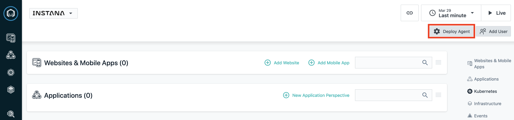

Next, select `OpenShift` as the platform and `Operator` as the technology and copy the `Instana Service Endpoint`, `Instana Service port` and `Instana Application Key`. These will be needed later when deploying the Instana Agent into your OpenShift cluster.

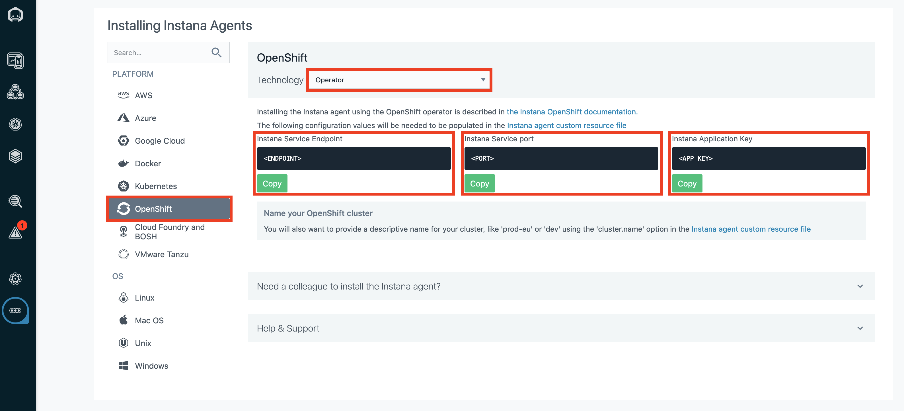

## 3. Implementar en OpenShift

1. Aprovisione un [clúster de OpenShift](https://cloud.ibm.com/kubernetes/catalog/create?platformType=openshift).
> NOTA: Este paso puede tardar unos 30 minutos.

2. Abra la consola de OpenShift y copie / pegue su comando de inicio de sesión ( `oc login...`) en una ventana de terminal.

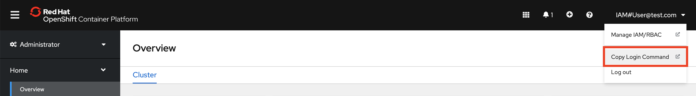

3. Desde la ventana de la terminal, ejecute el `build-and-deploy.sh` script para crear la aplicación Bee Travels e implementarla en su clúster de OpenShift.
> NOTA: Este paso puede tardar unos minutos.

```
cd instana-openshift
./build-and-deploy.sh -d <DOCKERHUB_USERNAME>
```

Una vez que se completa el script, puede verificar que los servicios de la aplicación se estén ejecutando en su clúster de OpenShift yendo a `Workloads` -> `Pods` en su consola de OpenShift. Además, verifique que está en el proyecto `bee-travels`recién creado . Debería tener el siguiente aspecto:

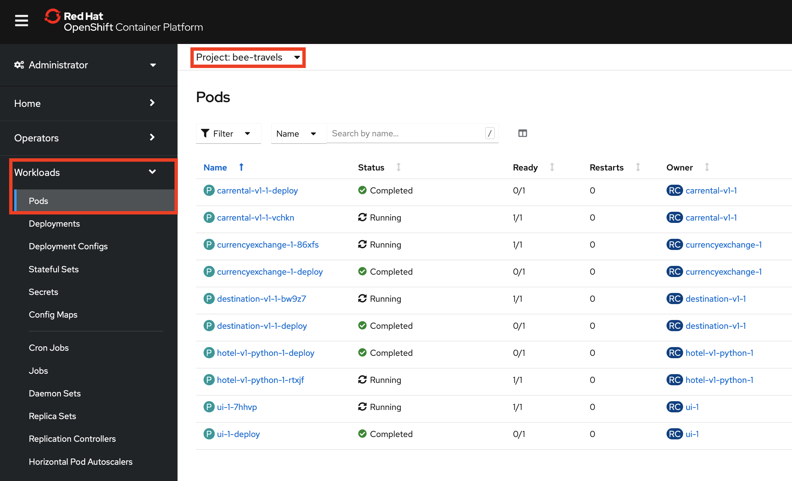

4. Ahora que los servicios de la aplicación están implementados en su clúster de OpenShift, es hora de exponer la interfaz de usuario mediante una ruta. Desde la consola de OpenShift, vaya a `Networking` -> `Routes` y presione el botón `Create Route`.

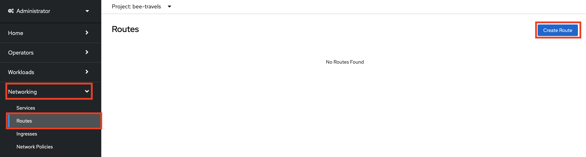

A continuación, complete los campos de la ruta exactamente como en la siguiente captura de pantalla y luego cree la ruta.


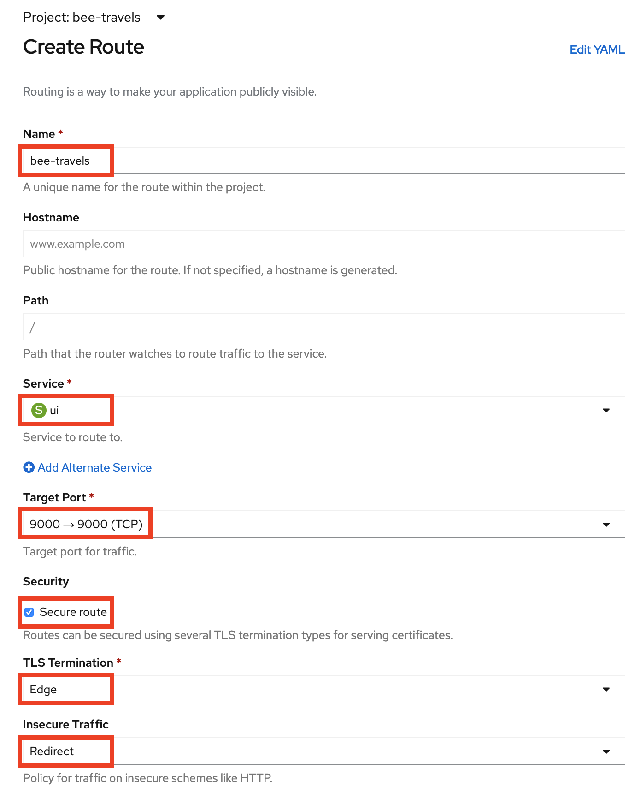

Tome nota de la ubicación / URL de la ruta recién creada, ya que será necesaria para más adelante.

5. El último paso con el clúster de OpenShift es instalar Instana Agent Operator desde OperatorHub. Primero, debe crear un proyecto para Instana Agent y configurar sus permisos. Desde la ventana de su terminal, ejecute los siguientes comandos:

```
oc new-project instana-agent
oc adm policy add-scc-to-user privileged -z instana-agent
```

A continuación, vaya a `Operators` -> `OperatorHub` en su clúster de OpenShift y busque Instana Agent Operator. Verifica que estás en el proyecto recién creado  `instana-agent`. Instale el operador.

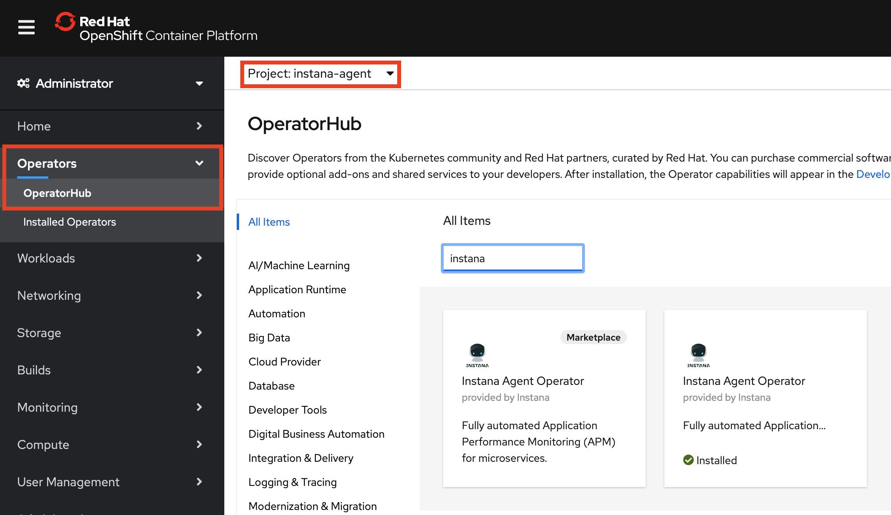

Una vez que el operador esté instalado, cree una instancia de un Agente Instana.

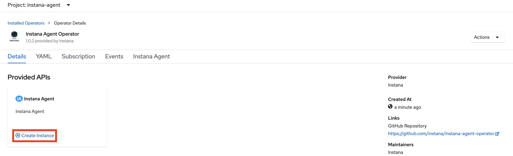

Asegúrese de configurar `YAML view` y editar el YAML para que se vea como la siguiente captura de pantalla. Aquí es donde incorporaremos las credenciales de Instana que se copiaron del paso anterior. `<APP KEY>` se refiere a `Instana Application Key`, `<ENDPOINT>` se refiere a `Instana Service Endpoint`, y `<PORT>` se refiere a `Instana Service port`. Una vez que el archivo YAML esté configurado correctamente, cree la instancia de Instana Agent.

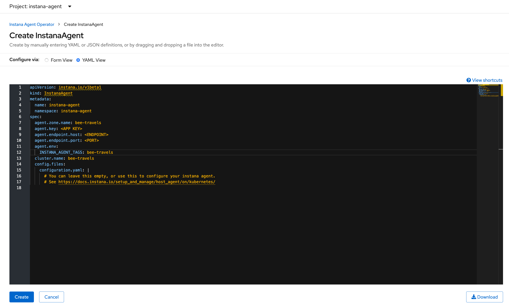

## 5. Generate Traffic and Analyze with Instana

At this point, you should start to notice your Instana dashboard populating with information from your OpenShift cluster. It is now time to start generating some traffic to the Bee Travels application that is running in your OpenShift cluster. To generate traffic, we will be using a script that uses [Puppeteer](https://developers.google.com/web/tools/puppeteer/). From your terminal window, run the following to generate traffic:

```
cd traffic
npm install
node traffic.js <NUM_CALLS> <ROUTE>
```

`NUM_CALLS` - refers to how many calls will be made to the Bee Travels application. Each call will make 2 requests to the application. One will be for searching hotels for a random city and the other will be for searching car rentals for the same random city.

`ROUTE` - refers to the created route's location/url from OpenShift. Make sure there is no trailing `/`

Once the traffic script is finished running, go to your Instana dashboard and click on your Bee Travels website to view the traffic. If you are not seeing any traffic, update your viewing time range in the top right corner. Once you are able to view the traffic, you can press `Analyze Page Loads` to view the individual calls made to the front end UI.

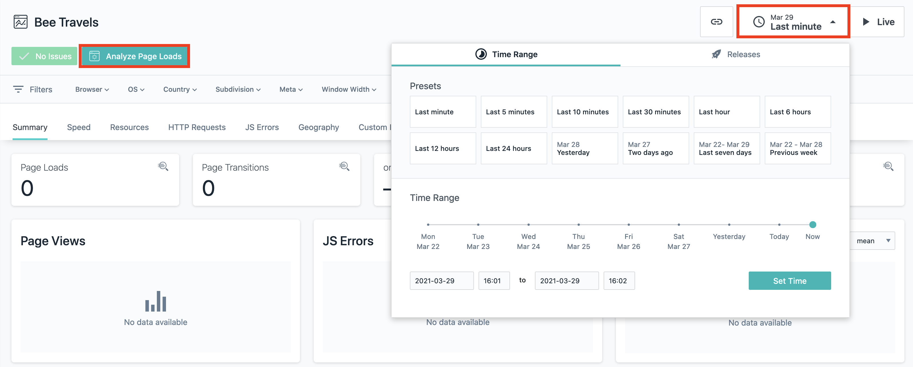

From here, you can scroll down to view all individual calls that were made to the front end UI. Select on one of the calls and click on the path to analyze the individual call.

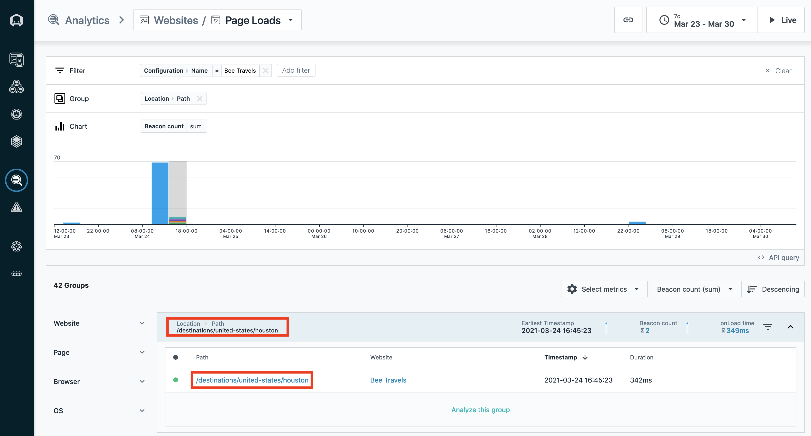

Once you are viewing the individual call, scroll down and view the XHR activity. You will notice that some of the requests have a `View Backend Trace` button. Clicking on the button will show a request trace for a backend Bee Travels service that is being called by an API call from the front end UI.

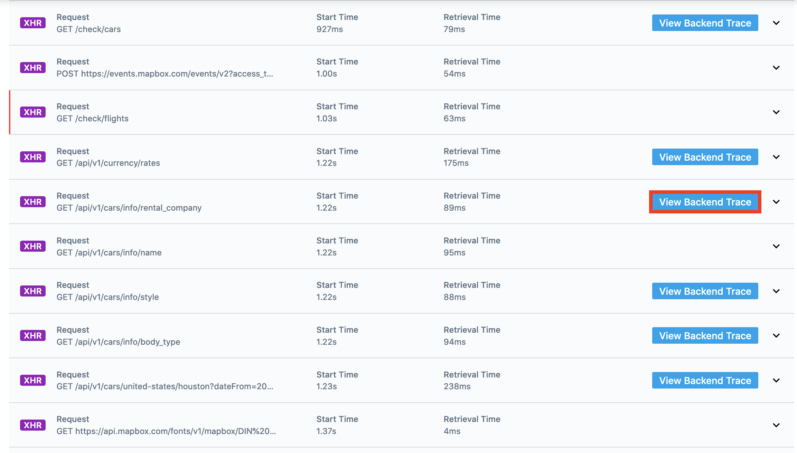

While viewing the trace, you can click on the service from the `Service Endpoint List` to analyze that backend service on Instana.

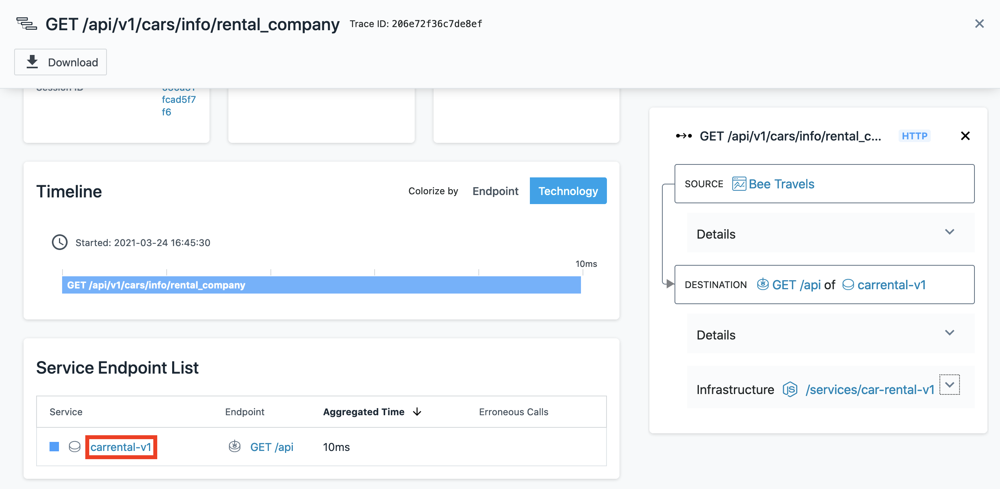

This is as far as this code pattern goes with analyzing Bee Travels on Instana but feel free to check out more of what Instana offers in the Instana dashboard.

# License

This code pattern is licensed under the Apache License, Version 2. Separate third-party code objects invoked within this code pattern are licensed by their respective providers pursuant to their own separate licenses. Contributions are subject to the [Developer Certificate of Origin, Version 1.1](https://developercertificate.org/) and the [Apache License, Version 2](https://www.apache.org/licenses/LICENSE-2.0.txt).

[Apache License FAQ](https://www.apache.org/foundation/license-faq.html#WhatDoesItMEAN)
